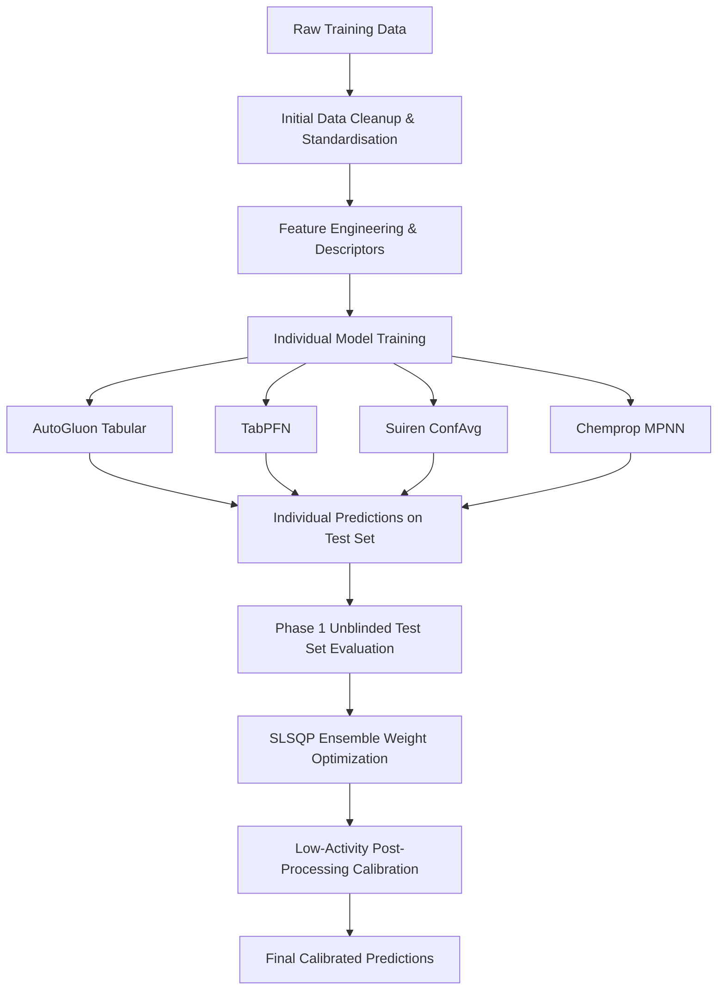

# PXR Activity Prediction Challenge — Final Phase Submission

This repository contains the source code, modeling workflows, and final ensembled predictions for the PXR (Pregnane X Receptor) Activity Prediction Challenge. 

Our final submission (**`submit_phase1_optimized_individual_members.csv`**) is an optimized, calibrated ensemble of diverse machine learning models trained on molecular descriptors, graph representations, and pre-trained foundation embeddings. This ensemble achieves a simulated **MAE of 0.4177** on the Phase 1 unblinded test set (a major improvement from the best Phase 1 leaderboard baseline of **0.4466**).

---

## Workflow Overview

---

## 1. Initial Data Cleanup & Standardization

To ensure high-quality training inputs, the raw SMILES strings and activities underwent the following pre-processing steps:
* **SMILES Sanitization**: All chemical structures were standardized using RDKit. Salts were stripped, charges were neutralized where possible, and SMILES strings were converted to canonical format.
* **Hydrogenation**: For 3D descriptor generation and specific foundation models (specifically Suiren-ConfAvg), molecular graphs were hydrogenated (`Chem.AddHs(mol)`) to ensure accurate 3D conformation averaging.
* **Target Harmonization**: The target property $pEC_{50}$ was checked for extreme outliers, and standard errors/confidence intervals were used to filter out highly noisy measurements where appropriate.

---

## 2. Feature Engineering & Descriptors

Our models leverage a highly complementary mix of physical chemistry descriptors, topological fingerprints, and learned embeddings:
* **Jazzy Descriptors**: Quantum-chemical properties and local ionization energies calculated using the Jazzy library for accurate hydrogen-bonding and electrostatic characteristics.
* **RDKit 2D Descriptors**: 200+ standard physical chemistry properties (molecular weight, LogP, polar surface area, bond counts, etc.).
* **ECFP4 Fingerprints**: Extended-Connectivity Fingerprints (both binary and count-based, radius 2, 2048-bit) to capture local topological substructures.
* **MiniMol Embeddings**: Compact, light-weight molecular embeddings capturing global structural representations.
* **3D Descriptors & Erg**: Electrotopological and 3D shape/pharmacophore features.
* **ChemAxon Descriptors**: Advanced ionization, pKa, and charge distribution descriptors.

---

## 3. Individual Models in the Final Ensemble

The final optimized submission is a weighted ensemble of five distinct models. Each model brings unique learning biases (tabular, Prior-Data Fitted, Graph Neural Network, and Deep Learning):

### 1. AutoGluon Tabular (Weight: 54.0%)
* **Description**: A multi-layer stacked ensemble of gradient boosting trees (LightGBM, XGBoost, CatBoost), Random Forests, and deep neural networks trained with AutoGluon's `extreme` preset.
* **Features**: Trained on a reduced feature set of 500 top-performing descriptors selected using mutual information regression (covering scaled Jazzy, RDKit, Erg, Avalon, MiniMol, and ChemAxon features).
* **Role**: Serves as the primary heavy-lifter for traditional tabular regression.

### 2. Suiren ConfAvg (Combined Weight: 34.9%)
* **Description**: A pre-trained molecular foundation model designed to learn conformation averaging features, fine-tuned on the PXR dataset. Two variants were trained:
  * **Suiren Hopt1 (17.9%)**: Hyperparameter-optimized variant utilizing a fine-tuned learning rate ($2.9 \times 10^{-4}$), batch size 8, and warm-up training epochs.
  * **Suiren Train 15-20 (17.0%)**: A multi-epoch checkpoint ensemble of the base foundation model.
* **Role**: Captures 3D spatial conformations and pre-trained structural patterns particularly useful for ADMET property prediction.

### 3. Chemprop Tuned MPNN (Weight: 10.6%)
* **Description**: A Message Passing Neural Network (MPNN) that learns molecular representations directly from the molecular graph, augmented with MiniMol descriptors.
* **Hyperparameters**: Optimized using a 2048-dimensional hidden layer, L2 regularization, and trained as an ensemble of multiple replicates to reduce variance.
* **Role**: Provides graph-based representation learning to complement descriptor-based tabular models.

### 4. TabPFN Regressor (Weight: 0.5%)
* **Description**: A Tabular Prior-Data Fitted Network that performs in-context learning in a single forward pass, optimized using cross-validation over combinatorial feature sets.
* **Role**: Acts as a robust tabular baseline, particularly in low-data regimes.

---

## 4. Phase 1 Recalibration & Ensembling

Following Phase 1, a subset of 254 test set molecules was unblinded. We utilized this clean, out-of-distribution (OOD) test subset to perform weight optimization and post-processing calibration:

### Step A: SLSQP Weight Optimization
Instead of simple averaging, we framed ensembling as a constrained optimization problem. We ran a Sequential Least Squares Programming (SLSQP) optimizer on the unblinded subset to minimize the Mean Absolute Error (MAE):
* **Equal-weights ensemble MAE**: `0.4584`
* **Optimized-weights ensemble MAE**: **`0.4422`**

### Step B: Post-Processing Calibration (Low-Activity Shift)
Error diagnostics on the unblinded set revealed a systematic **regression-to-the-mean** compression effect: the ensemble predicted inactive/low-activity compounds ($pEC_{50} < 3.0$) with a mean of **3.95** (an average overprediction of **+0.36**). 

To correct this compression, we optimized a piecewise calibration rule:
$$\text{If } pEC_{50\_pred} < 4.60, \text{ then } pEC_{50\_calibrated} = pEC_{50\_pred} - 0.34$$

This calibration step dropped the final simulated MAE to **`0.4177`**, yielding a highly refined set of predictions for the remaining blinded test compounds.
